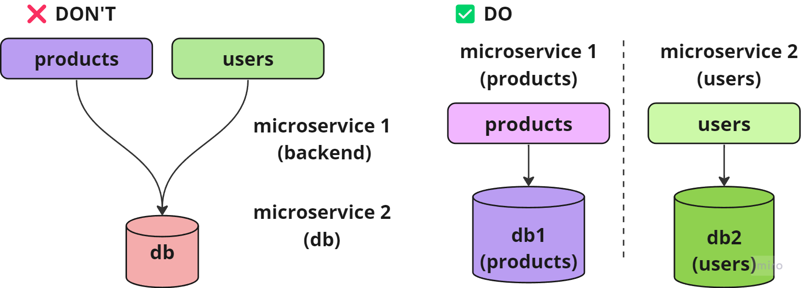

# Microservices

# What it is?

---

Collection of small, loosely coupled services. These services are designed to be independently deployable, maintainable, and scalable.microservices break down the application into smaller, self-contained services that communicate with each other through well-defined APIs.

# Characteristics

---

- **Service Independence:** **Each microservice operates independently** and **can be developed, deployed, and scaled separately** from the others. This independence allows teams to work on different microservices without affecting the entire system.
- **Decentralized Data Management:** Microservices often have their own databases or data stores, which means they **have control over their own data and schemas**. This can help **prevent data coupling between services**.
- **API-Based Communication:** Microservices communicate with each other through APIs, typically using lightweight protocols like HTTP/REST or gRPC. This allows them to be language-agnostic and enables interoperability.
- Loose Coupling: Microservices are designed to be **loosely coupled**, meaning they have **minimal dependencies on other services**. This **reduces the risk of changes in one service impacting others**.
- Scalability: Services can be scaled independently based on their **specific resource needs**. This **enables efficient resource utilization and cost savings**.
- **Resilience:** Microservices are expected to be **resilient to failures**. If one service encounters an issue, it **should not bring down the entire application**. **Redundancy**, **load balancing**, and **failover strategies** are **commonly employed**.
- **Continuous Delivery:** Each microservice can be **built, tested**, and **deployed independently**, **facilitating** continuous integration and continuous delivery (**CI/CD**) practices.
- **Technology Diversity:** Teams can choose the **most appropriate technology stack for each microservice** based on the specific requirements of that service. This allows for **flexibility** and **innovation**.
- **Organizational Alignment:** Microservices can align with the structure of development teams. Each team can be responsible for one or more microservices, making **ownership** and **accountability clear**.

# Pros and Cons

---

**✅ Pros**

- Increased agility
- Easier maintenance
- Improved scalability.
- Increased security (reduced modification scope)

**❌ Cons**

- Introduce complexities related to service discovery
- Inter-service communication (asynchrony between services) and data management.

# Do’s & Don’ts

---

Its a good practice that each microservices has its own database and no share the database across multiple microservices. It causes scalability problems and increase issue identification.