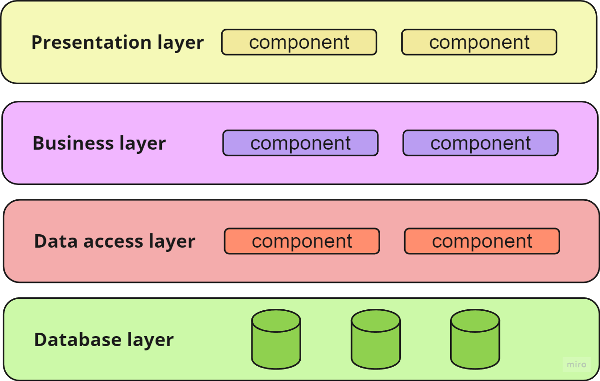
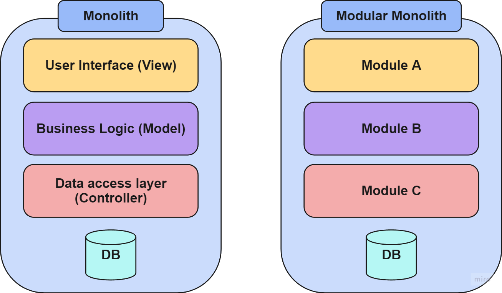
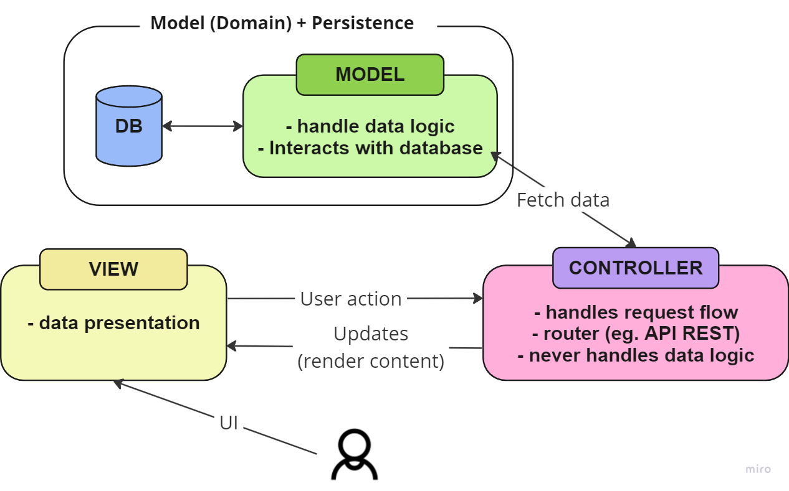
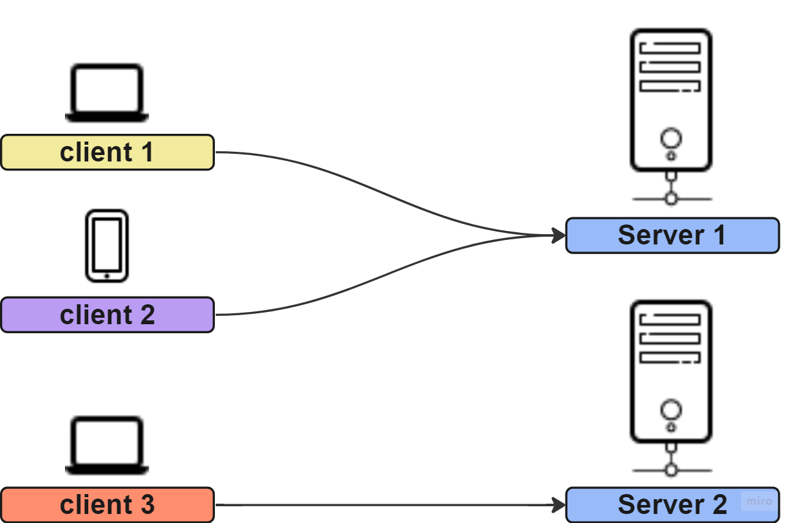
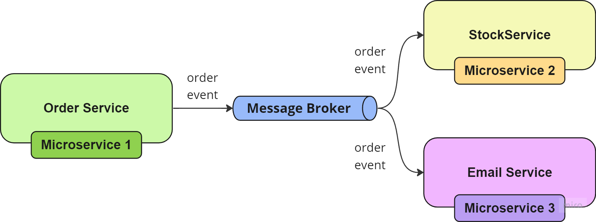
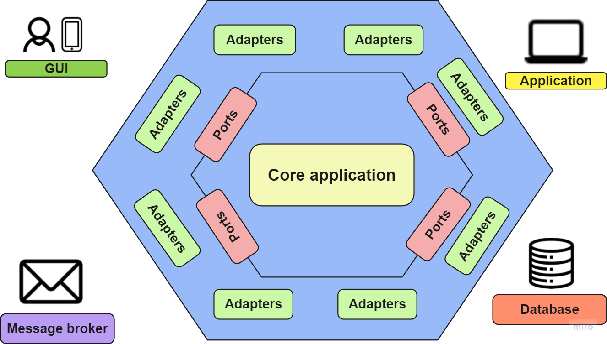
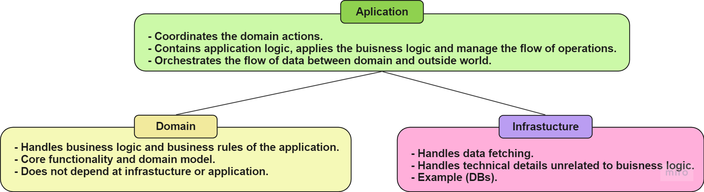
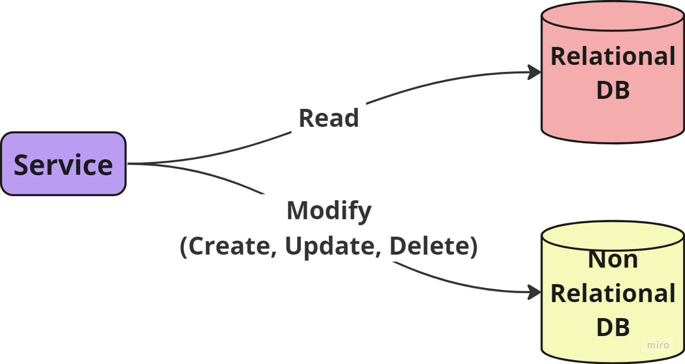
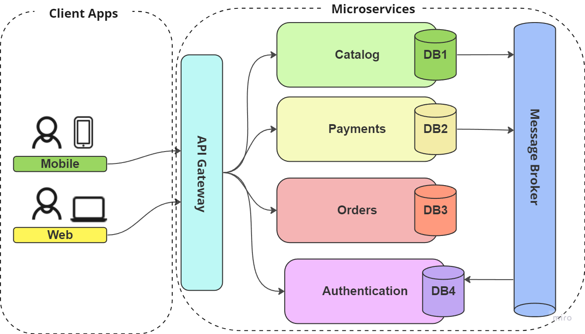

# Architecture patterns

<aside>
📌 In this section, we will address some of the patterns that have marked the evolution of software architecture throughout its existence. It is important to note that these patterns do not appear in isolation in emerging programs; at times, a program may incorporate various patterns or elements thereof. This interweaving of architectural structures contributes to the diversity and complexity inherent in the conception and development of software.

</aside>

# Patterns

## [1970s] Layered

---

Divides system in layers, **each layer has specific responsibilities** and interacts only with the layers directly above or below it. Common layers include presentation, business logic, data access, and database layers. Or can have layers such as **Aplication-Domain-Interface** (layers system that proposes Eric Evans at DDD).

> *figure: Example of layered architecture, having 1970s aproach*
> 

What is a layer? A layer is a group of modules. A "module" refers to a functional unit or independent component that performs a specific task within a larger program or system.

What are the benefits? Layers simplify development and maintenance.

## [1980s] Monolithic

---

All components of the application are **interconnected and interdependent as a single, indivisible unit**.

What are the pros?

- Easy to add new functionalities to the system (develop at early stages)
- Easy to debug at early stages.

What are the cons? ****
- **Poor scalability** due that the system is not fragmented. C**omplex** and **difficult** to **manage** as the **application grows**.
- Can have a **high workload** because it is not distributed.

> *figure: Example of monolith architecture*
> 

## [1970s-1980s] Model-View-Controller (MVC)

---

This approach divides an application into three interconnected components: the **model** (**data**), the **view** (**user interface**), and the **controller** (**business logic**). This separation supports **modular** development and simplifies the process of **updating** or **changing** parts of the application. However, it's deprecated due to the **difficulty in identifying these entities within the code**. Additionally, the business aspect is often overlooked when discussing the problems that the software aims to solve. To solve that appeared **Domain Driven Design (DDD)**.

> *figure: Example of MVC architecture*
> 

This architecture was so famous when all webs/GUIs appear PHP “boom”. As you can see in the *figure* the model and the persistence were treated as single unit, ant then appear the famous **ORMs**. 

**What is an ORM?** Is a framework to build “model + database” entities.

## [1980s] Client-Server

---

A standard model for networked applications where multiple **clients request** and **receive** **services** from a **centralized server.**

> *figure: Example of Client-Server architecture*
> 

## [1990s-2000s] Service-Oriented-Architecture (SOA)

---

This architecture emerged as a response to the challenges posed by the popularity of Monolithic architectures. It is designed to enhance scalability and simplicity by breaking down complex monolithic structures into modular, independently deployable services. SOA facilitates better organization, maintenance, and scalability of software systems by promoting the development and integration of loosely coupled, interoperable services.”

## [2000s] Event-Driven-Development(EDD)

---

This pattern is designed around the **production, detection, consumption, and reaction to events.** **EDD** is particularly useful in systems that need to be highly **responsive** **and** **reactive**, such as **real-time** analytics **applications**.

> *figure: Example of EDD*
> 

Message Broker is the core part of this architecture. Message Broker is also known as: EBS (Enterprise Message Bus), EMS (Enterprise Message System). It is often used in Java ecosystem. There are some frameworks and softwares that help you to use events and work with them, such as: [RabbitMQ](https://www.rabbitmq.com/) , [Apache Kafka](https://kafka.apache.org/), [ActiveMQ](https://activemq.apache.org/) and [ZeroMQ](https://zeromq.org/)

## [[2000s] Hexagonal Architecture](https://www.notion.so/Hexagonal-Architecture-f8a5061a11dd40d0b5ceb78a9de8e70a?pvs=21)

---

This pattern **allows** an **application to be equally driven** by users, programs, automated tests, or batch scripts, and to be **developed** and **tested** in **isolation** from its **eventual runtime devices** and **databases**. It aims to **create loosely coupled** **components** that can be easily connected to their software environment through **ports and adapters**. It is useful for applications where business logic (**domain**) needs to be **kept separate** from **external concerns** like **databases**, **user** **interfaces**, and other services. This architecture is the first aproach of **Domain Driven Design (DDD).**

> *figure: Example of Hexagonal Architecture*
> 

## [[2000s] Domain Driven Design (DDD)](https://www.notion.so/DDD-Domain-Driven-Design-92b41d98e49c452d9d9518592aa43500?pvs=21)

---

While not an architectural pattern per se, **DDD provides** a set of **principles for designing software** that closely **aligns** with **business requirements**. It emphasizes a **model-driven** approach **to software design**.

> *figure: Example of DDD layer segmentation proposed by Eric Evans*
> 

## [[2010s] CQRS (Command Query Responsibility Segregation)](https://www.notion.so/CQRS-Command-Query-Responsibility-Segregation-9dc4e7eaf81c4191a9499b05bc78dde9?pvs=21)

---

This pattern **separates reading** data (query) from **modifying** data (command) and is typically used in **conjunction with event sourcing EDD and Microservices**. It allows for **high performance, scalability**, and **maintainability**. 

Basic explanation: the system stores messages (event messages) that generate modifications over DB. This action allow to rebuild/restore the application state by reading all of the modification messages that you’ve stored.

> *figure: Example of CQRS*
> 

✅ Pros

- Can rebuild or restore the application state at any moment the application existed.

❌ Cons

- Seniority to create and maintain the compleixity of the system.
- High dificulty since beggining
- The modifications along the program exist should be compatible with how the data is stored in DB.

## [[2010s] Microservices](https://www.notion.so/Microservices-8250a315ad1e4085a5a6cfae0bd3ef42?pvs=21)

---

**Collection of loosely coupled, small**, **autonomous** **services** that focus on specific business capabilities. Allow for **independent development** and **deployment** of services, making the architecture **highly scalable** and **resilient.**

> *figure: Example of Microservices Architecture*
> 

ADD