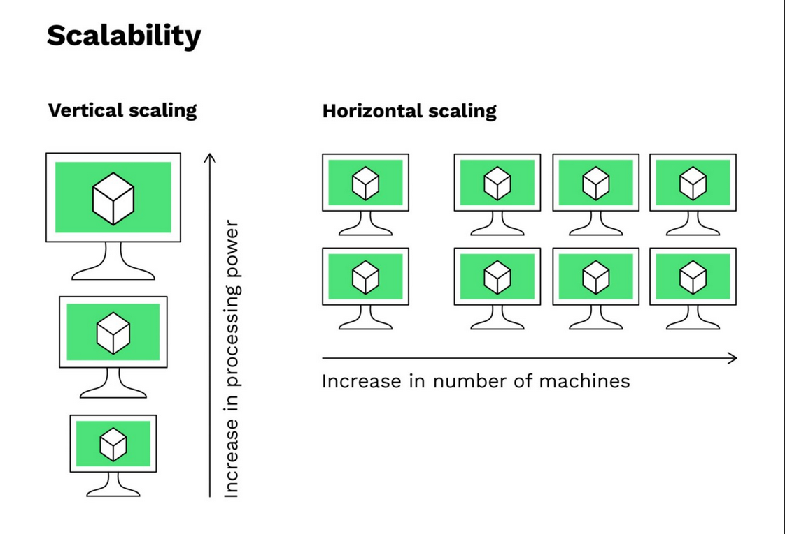

# Scaling an architecture

# What it is?

---

Scaling an architecture, refers to adjusting the capacity of a system to handle a greater volume of load or to improve its performance. There are two common dimensions of scaling: **horizontal** and **vertical**.

> *figure: Visual representation of vertical and horizontal scaling*
> 

# **Horizontal** Scalability **(Scaling out)**

---

Involves increasing the capacity of a system by **adding more machines (servers) to your network** or by **distributing the workload** **across multiple machines**. Is often preferred for modern web applications and **microservices architectures** because it **provides flexibility** and can be more **cost-effective as you can add or remove servers as needed.**

**Key characteristics**

- New servers or instances are added to the existing infrastructure to **share the load**.
- Each server in a horizontally scaled setup is typically identical (**homogeneous**).
- Horizontal scaling is often used to **distribute web traffic, application processing, and database read operations.**

# Pros and Cons of Horizontal Scalability

---

### **✅ Pros**

- Provides a **cost-effective** way to increase capacity as it can use **commodity hardware**. For workloads that can be easily distributed across multiple nodes.
- **Scalability** can be achieved **more easily** because you can keep adding machines as needed. Well-suited for applications with fluctuating demands.
- **Fault Tolerance and High Availability:** failure of one node usually doesn't bring down the entire system. Redundant nodes can take over the workload.
- **Flexibility:** It allows for the addition or removal of resources as needed, which is especially beneficial in cloud environments where resources can be dynamically allocated.
- **Load Distribution:** Spreading the load across multiple nodes can lead to more efficient use of resources and better overall system performance.

### ❌ Cons

- **Complexity in Management:** Managing a distributed system with many nodes can be more complex than managing a single, more powerful node.
- **I**ncreased Overhead: introduce more network traffic and overhead due to communication between nodes.
- **Software Limitations:** Some software might require significant modification to run efficiently in a distributed environment.
- **Consistency Challenges:** Ensuring data consistency across multiple nodes can be challenging requiring more sophisticated data management and synchronization.
- **Initial Setup Cost:** Might require a more significant initial investment in infrastructure and configuration.
- **Latency Issues:** Network latency can affect performance.

# Vertical Scalability **(Scaling out)**

---

Involves **increasing the capacity of a single machine by adding more resources** (e.g., CPU, RAM, storage) to it. **Typically used when you have legacy systems or applications that are inherently limited by the capacity of a single server** and need to scale up for additional performance

**Key characteristics**

- The same machine is **expanded with more powerful hardwar**e, making it capable of handling **larger workloads**.
- Used when an application's performance is limited by the **capacity of a single machine**.

# Pros and Cons of Horizontal Scalability

---

### ✅ Pros

- **No Immediate Architectural Changes:** It does not require significant changes to the software architecture.
- **Simpler to manage** compared to distributed systems.
- Can be a **more cost-effective solution** when you're **not dealing with extremely high workloads**.
- **Consistency and Performance:** Since all resources are centralized, there are fewer issues with data consistency and network latency.
- **Lower Software Overhead:** reduces the complexity associated with network communications and data synchronization required in horizontally scaled systems.

### ❌ Cons

- **Limited by the physical constraints of the hardware**, which can be costly and reach a ceiling in terms of scalability.
- **Potential for Single Point of Failure: Less fault-tolerant** because if the single server fails, the entire system may go down.
- **Downtime for Upgrades:** Upgrading hardware may require downtime, which can be disruptive to operations, especially for systems that require high availability.
- **Cost**: High-end hardware can be expensive, and the cost can increase significantly as you approach the upper limits of available technology.
- **Less Flexibility:** Unlike horizontal scaling, where resources can be added or removed dynamically to match demand, vertical scaling lacks this flexibility.
- **Not Suitable for All Workloads:** Some applications, particularly those designed to distribute their workload across multiple nodes, may not benefit as much from vertical scaling.
