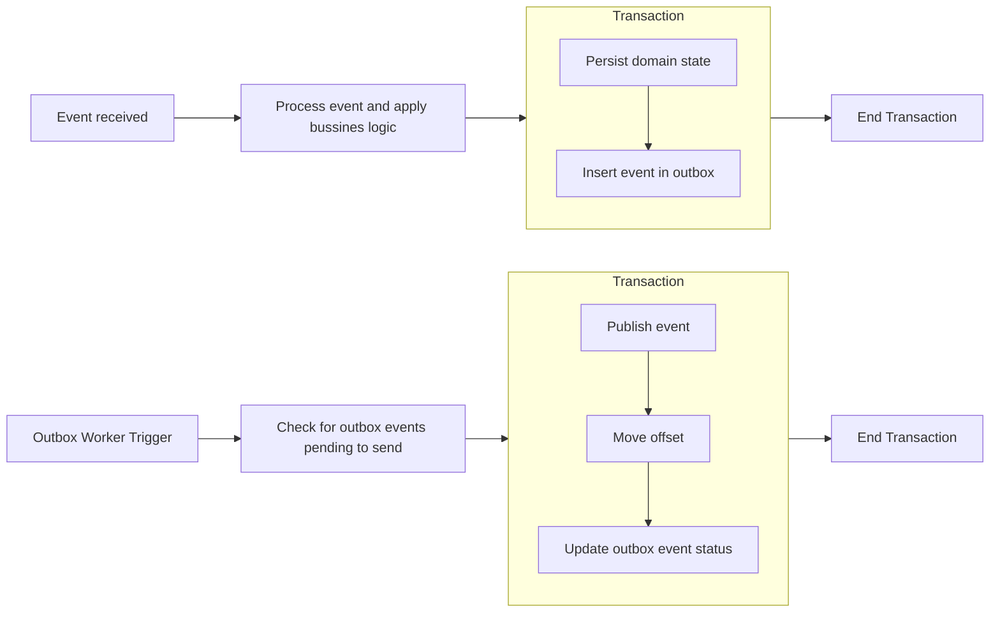

# [EDD] Event-Driven Design

import { Callout, Card, Eventual, FileTree } from 'nextra/components'

<Callout type="info">
**Event-Driven Design (EDD)** is an architecture where the system reflects and communicates important business changes through **events**. Services react to what happens, rather than through direct calls.
</Callout>

EDD is ideal for systems that are `Distributed`, `Scalable`, and `Resilient`.

<Callout>
Assume failures, design for them, and use events as the language of the business. It is often used alongside DDD.
</Callout>

---

## What is an event?
An **event** represents a **domain fact** that has already occurred and cannot be changed.

Examples:
`OrderCreated`
`PaymentConfirmed`
`UserRegistered`

<Callout type="warning">
An event **is not an intention**, it is a statement of the past.
</Callout>

---

## Core components in EDD
<table style={{ borderCollapse: 'collapse', width: '100%' }}>
  <thead>
    <tr>
      <th style={{ border: '1px solid #e5e7eb', padding: '8px', textAlign: 'left' }}>Component</th>
      <th style={{ border: '1px solid #e5e7eb', padding: '8px', textAlign: 'left' }}>Description</th>
      <th style={{ border: '1px solid #e5e7eb', padding: '8px', textAlign: 'left' }}>Responsibilities</th>
      <th style={{ border: '1px solid #e5e7eb', padding: '8px', textAlign: 'left' }}>Examples</th>
    </tr>
  </thead>
  <tbody>
    <tr>
      <td style={{ border: '1px solid #e5e7eb', padding: '8px' }}>Broker</td>
      <td style={{ border: '1px solid #e5e7eb', padding: '8px', color: "#838383ff" }}>Ensures event delivery</td>
      <td style={{ border: '1px solid #e5e7eb', padding: '8px', color: "#838383ff" }}>
        <ul>
          <li>Message persistence</li>
          <li>Retries</li>
          <li>Ordering within a partition</li>
        </ul>
      </td>
      <td style={{ border: '1px solid #e5e7eb', padding: '8px', color: "#838383ff" }}>Kafka, RabbitMQ</td>
    </tr>
    <tr>
      <td style={{ border: '1px solid #e5e7eb', padding: '8px' }}>Producer</td>
      <td style={{ border: '1px solid #e5e7eb', padding: '8px', color: "#838383ff" }}>Service that emits the event</td>
      <td style={{ border: '1px solid #e5e7eb', padding: '8px', color: "#838383ff" }}>
        <ul>
          <li>Generate the event after a domain change</li>
          <li>Send the event to the broker</li>
        </ul>
      </td>
      <td style={{ border: '1px solid #e5e7eb', padding: '8px', color: "#838383ff" }}>—</td>
    </tr>
    <tr>
      <td style={{ border: '1px solid #e5e7eb', padding: '8px' }}>Consumer</td>
      <td style={{ border: '1px solid #e5e7eb', padding: '8px', color: "#838383ff" }}>Service that processes the event</td>
      <td style={{ border: '1px solid #e5e7eb', padding: '8px', color: "#838383ff" }}>
        <ul>
          <li>Process the event correctly</li>
          <li>Be idempotent</li>
          <li>Handle retries</li>
          <li>Send ACK to the broker</li>
        </ul>
      </td>
      <td style={{ border: '1px solid #e5e7eb', padding: '8px', color: "#838383ff" }}>—</td>
    </tr>
  </tbody>
</table>

---

## Eventual Consistency
<Callout type="warning" emoji="⚠️">
In distributed systems like those using EDD, **not all parts of the system are consistent at the same time**.
Each service processes events at its own pace. Over time, all converge to the same state.
</Callout>

Example:  
Order created --> Billing processes it --> Notifications process it

States may differ temporarily, but the system eventually becomes consistent.

---

## Failures in distributed systems

<Callout type="warning">
In distributed systems, **failures are not an exception, they are the norm**.
</Callout>

Common principles:
- `At-least-once`: the event may arrive more than once; the broker and consumer must handle this.
- `At-most-once`: the event may be lost.
- `Must-once`: the event arrives at least once; if it arrives multiple times, the consumer must be idempotent (final effect is the same whether it’s delivered once or several times).
- `Exactly-once`: the event is received only once; this rarely happens and is expensive, so it cannot be assumed.

---

## Core Principles

### 1. Events reflect domain state changes
They are only emitted when something relevant to the business changes.

### 2. Events are immutable
Once emitted, **they do not change**. If something changes, a new event is emitted.

### 3. Idempotency
A consumer must be able to process the **same event multiple times** without side effects.  
This is critical because:
- Distributed systems fail
- Retries occur
- Duplicates may exist

<Callout type="info">
Processing N times must produce the same result as processing once.
</Callout>

Learn more at [Idempotency in Distributed Systems](/software_design/distributed-systems/idempotency).

---

### 4. Event ordering
In some flows, order matters.  

Example: events per customer, partition key would be the customer ID (`client_id`).  

This is achieved with **partitions**.

<Callout type="info">
Within a partition, events are processed in FIFO order.
</Callout>

---

### 5. Durability and reliability
Events must not be lost.

<Callout type="info">
Achieved through: **persistent brokers**, **logs**, and **database persistence**.
</Callout>

---

### 6. Security
<Callout type="error">
Events do not expose sensitive data or internal schemas; they follow clear contracts (schema, version).
</Callout>

<Callout type="info">
**Event Authentication** through producers and consumers.
👉 The authentication does not occur in Kafka or the event.
👉 It occurs when a microservice exposes or consumes a synchronous API.

**Events are not authenticated**; they are authorized/secured by infrastructure:

- Infrastructure security:
  - TLS
  - SASL
  - ACLs de Kafka: ACL (Access Control List) defines what identity can perform an action on what resource.
    * Example: an ACL per topic is a rule like: “Service X can PRODUCE in topic Y, but not CONSUME.”

- Authorization by:
  - Topic
  - Consumer group
  - Service

Kafka ensures:
- Who can **publish**
- Who can **consume**
</Callout>
---

### 7. Observability
<Callout type="warning" emoji="👀">
It should be possible to:
- **Event Trace**: trace an event end-to-end
- **Debug failures**
- **Correlate events**
</Callout>

<Callout type="error">
- **Events** → what happened (business event)
- **Traces/logs** → how it happened (flow and processing time)
</Callout>

Example of traces for a `CustomerCreated` event published by a microservice:
```
{
  "event": "CustomerCreated",
  "customerId": "123",
  "traceId": "trace-1001",  // the entire creation operation
  "spanId": "span-02",      // this specific step: publishing the event
  "createdAt": "2026-01-22T12:00:00Z"
}
```
- `traceId` connects the event through all microservices.
- `spanId` shows exactly which step produced this event.

If you only include `traceId` without `spanId`, you can still track the flow, but you won’t be able to measure latency or pinpoint which step generated each event.

---

## Idempotency in depth

As mentioned before, in distributed systems failures are normal, so events may be duplicated due to:

<Callout type="error" icon="🔄">
Service crashes/restarts
</Callout>
<Callout type="error" icon="🌐">
Network failures
</Callout>
<Callout type="error" icon="🔄">
Broker re-sends or producer retries
</Callout>

<Callout type="warning">
It is the consumer's responsibility to protect against these cases.
</Callout>

### Common techniques

<FileTree>
  <FileTree.Folder name="consumers" defaultOpen>
    <FileTree.File name="process_event.ts" />
  </FileTree.Folder>

  <FileTree.Folder name="db" defaultOpen>
    <FileTree.File name="ingested_events" />
  </FileTree.Folder>
</FileTree>

1. **Idempotence key**
<Callout>
Store the <strong>event_id</strong> and <strong>ignore it if already processed</strong>
</Callout>

2. **Safe modification operations**
<Callout>
Use <strong>append/patch</strong> instead of <strong>insert</strong>
</Callout>

---

## Event Sourcing

The state is **not stored as a snapshot (final value)**, it is reconstructed from events. That is, it consists of **storing all events that caused state changes** to rebuild the current state.

<Callout>
Characteristics:
- Events are the source of truth
- State can be recalculated
- Full audit trail
</Callout>

<Callout type="info">
Not always necessary, but fits very well with EDD.
</Callout>

---

## How to prevent event loss

### On the broker

- Persistent broker (Kafka / RabbitMQ): events are persisted.
- Recovery after crashes: events are resent from the broker's last known state.
- Partitions for ordering: events in a partition are processed in FIFO order.
- **Dead Letter Queue (DLQ)**: failed events are sent to this queue for later detailed evaluation (even manually).

#### What is a DLQ?
A queue that allows: **reprocessing failed events** and **analyzing errors**.

---

### In the system

- Persistent logs: Cloudwatch / ELK / Loki, etc.
- Monitoring: allows visualization and analysis of events in real-time and over time (Prometheus/Grafana).
- Alerts: allow preventing erroneous behaviors.

---

### On the consumer

Typical flow:



---
### On the producer
The **Outbox Pattern** applies

## Outbox Pattern

<Callout type="info">
Prevents losing events when the DB and broker are not synchronized.
</Callout>


``` mermaid
flowchart TD
    A[Incoming Event] --> B["Consumer / Domain Service\n1. Update domain state\n2. Write outbox event"]
    B -->|DB Transaction| C["Outbox Table\n(PENDING / SENT)"]
    C -->|Background worker (publishes) | D[Message Broker]
```

The **Outbox Pattern** is applied by the **consumer service** that receives an event, **persists a domain change**, and as a consequence **must publish a new event**.

In other words, the actor implementing the Outbox Pattern is the **consumer that becomes a producer**.

---

### The problem it solves

A common event-driven flow is:

1. A microservice consumes an event
2. It persists a domain state change
3. It publishes a new event to the broker

If the service crashes between steps 2 and 3:

* The domain state is already persisted
* The outgoing event is never published
* The system becomes inconsistent

---

### Role of the Outbox-enabled service

The service:

* **Consumes** upstream events
* **Persists** domain state changes
* **Produces** downstream events

The Outbox Pattern ensures these responsibilities are handled safely.

---

### How it works

1. The service receives an event
2. A database transaction is started
3. The domain change is persisted
4. The outgoing event is written to an **outbox table**
5. The transaction is committed

A separate background worker:

* Polls the outbox table
* Publishes pending events to the broker
* Marks events as `SENT`

---

### Typical outbox states

* `PENDING`: waiting to be published
* `SENT`: successfully published
* (optional) `FAILED`: failed after retries

---

### What this pattern provides

* Guarantees that **if the domain state exists, the event will eventually exist**
* Enables safe retries
* Prevents event loss
* Decouples domain logic from broker availability

---

### Relationship with idempotency

Because delivery is usually *at-least-once*:

* Downstream consumers **must be idempotent**
* The Outbox Pattern guarantees delivery, not uniqueness

Both patterns complement each other.


<Callout> In the Outbox Pattern, if the broker goes down, events remain in the outbox table with status `PENDING` and will be retried when the broker comes back; if the publisher crashes right after committing the transaction, the events are already in the outbox, so no events are lost and the worker can send them when the publisher restarts. </Callout>
